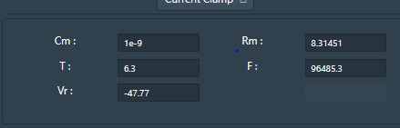
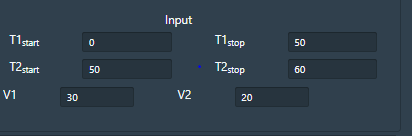

## Procedure

Exercise focuses on studying the importance of Na+ channel in action potential initiation and understanding the dynamics of Na+ channels in detail. Na+ channel consists of activation and inactivation gates, both these gates regulate the ionic movement across the membrane.

•	The GUI allows the user to provide their choice of transmembrane voltage ie current clamp or voltage clamp by clicking on the “Run control” radio buttons. 

 &nbsp;

•	User can change the parameters like Cm=Membrane Capacitance (nF), Rm  = Membrane resistance (MΩ),Vr  = Resting Voltage (mV),T = Temperature (0C) and F= Frequency. 

 &nbsp;

•	The conductance of ion channels that generate an action potential can also change in the simulator ie gNa = Conductance of Sodium ions, gK= Conductance of Potassium ions, gCl= Conductance of Chloride ions.

 &nbsp;

•	User can provide internal or external ionic concentration (Sodium, chloride and potassium) in voltage gated ion channel simulator by clicking on “channel” window and understand the membrane properties of ion channels which generate an action potential.

 &nbsp;

•	To understand the ionic mechanisms of the action potentials in the channel, user can provide three selective chemical agents{(Tetrodotoxin(TTX) Tetraethyammonium(TEA),Pronase} which block the voltage dependent membrane channels. By clicking on “Drug” window, user can apply the agents TTX(Inhibit Na current), TEA (Inhibit K current) and Pronase (eliminate Na+ inactivation) at any point of the simulation.

 &nbsp;

•	The GUI also allows the user to provide varying time ranges as input parameters. T1 = Time (T1 start, suppose 10 s and T2 stop 20s). The simulator will read the output from 10s to 20s. Likewise T2 Start and T2 Stop can be given according to users choice. V1 and V2 indicates applied voltage at the specified time duration. 

 &nbsp;

For simulating the neuronal membrane and inject current to generate spike. At the resting potential of neuronal membrane the sodium conductance will be at zero. With the input stimuli, depolarization of  the neuronal membrane occurs, the Na+ activation gate m opens, the conductance of sodium increases resulting in membrane depolarization. Opening of K+ channels cause repolarization of the membrane (without these channels the membrane remains depolarize) this can be simulated by changing the conductance of K+ channels to zero. The neuronal membrane will depolarize but not repolarize because of absent of K+ channels, the Vm remains high. new resting value is contributed by leakage channels and (not fully closed Na+ channels).

 &nbsp;
